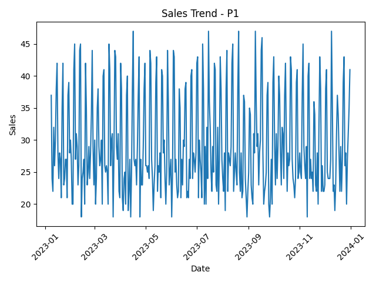
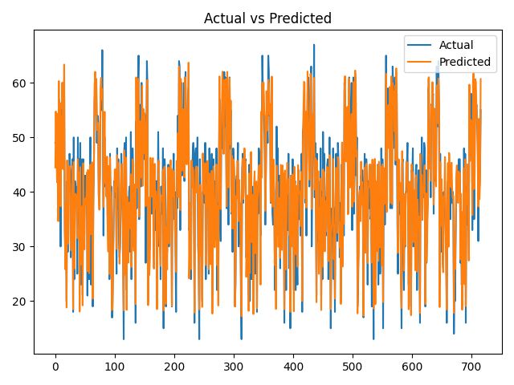

# 🛒 Retail Sales Forecasting & Inventory Optimization System

## 📌 Project Overview

This project builds an end-to-end data-driven system to forecast retail sales and optimize inventory decisions. It simulates real-world retail operations using synthetic data and applies machine learning to generate actionable business insights.

---

## 🎯 Problem Statement

Retail businesses often struggle with:

* Stockouts → lost sales
* Overstock → high holding costs
* Poor demand planning

This project solves these by:

* Predicting future demand
* Calculating optimal inventory levels
* Generating reorder recommendations

---

## 💼 Industry Relevance

Used by companies like:

* Amazon, Flipkart → demand forecasting
* Walmart, Reliance Retail → inventory optimization

Impact:

* Reduced stockouts
* Improved inventory turnover
* Better working capital management

---

## ⚙️ Tech Stack

* Python
* Pandas, NumPy
* Scikit-learn
* Matplotlib
* SciPy

---

## 🧠 System Architecture

```
Data → Preprocessing → Feature Engineering → ML Model → Forecast
      → Inventory Logic → Visualization → CSV Reports
```

---

## 📂 Project Structure

```
Retail-Forecasting-System/
│
├── data/
│   └── data.csv
│
├── outputs/
│   ├── sales_trend.png
│   ├── prediction_vs_actual.png
│   ├── predictions.csv
│   ├── inventory_report.csv
│
├── src/
│   ├── preprocess.py
│   ├── features.py
│   ├── model.py
│   ├── inventory.py
│   ├── visualize.py
│   ├── export.py
│
├── main.py
├── requirements.txt
└── README.md
```

---

## 🔄 Workflow

1. Data Generation (Synthetic Retail Data)
2. Data Cleaning & Validation
3. Feature Engineering (lags, rolling stats)
4. Model Training (Random Forest Regressor)
5. Sales Forecasting
6. Inventory Optimization:

   * Safety Stock
   * Reorder Point
   * Order Quantity
7. Visualization
8. Export Reports

---

## 📊 Results

### 📈 Sales Trend



### 📉 Actual vs Predicted



---

## 📦 Output Files

* `predictions.csv` → Forecast vs actual
* `inventory_report.csv` → Inventory decisions
* `sales_trend.png` → Demand trend
* `prediction_vs_actual.png` → Model performance

---

## ▶️ How to Run

### 1. Clone Repository

```
git clone https://github.com/your-username/repo-name.git
cd repo-name
```

### 2. Install Dependencies

```
pip install -r requirements.txt
```

### 3. Run Project

```
python main.py
```

---

## 📈 Business Value

* Predicts product demand
* Reduces stockouts
* Optimizes inventory levels
* Improves operational efficiency

---

## 🧪 Simulation Details

* Daily sales data for multiple products
* Seasonality (weekend demand spikes)
* Random demand variations
* Realistic retail patterns

---

## 🚀 Future Improvements

* Multi-store forecasting
* Real-time dashboard (Streamlit)
* Price elasticity modeling
* Promotion impact analysis
* Deep learning models (LSTM)
* API deployment

---

## 🎓 Learning Outcomes

* Time-series forecasting
* Feature engineering
* Model evaluation
* Inventory optimization logic
* End-to-end ML pipeline

---

## 👤 Author

**Your Name**
Aspiring Data Scientist / Analyst

---

## ⭐ If you found this useful, consider giving a star!
